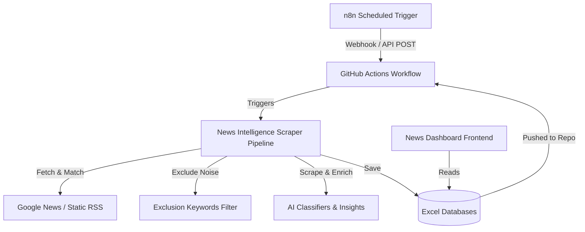

# Tabhi Group Competitor News Scraper & Dashboard

This repository contains the end-to-end codebase for the **Tabhi Group Competitor News Intelligence Platform**. The platform dynamically scrapes competitor news, analyzes and classifies it using AI rules, saves the structured data in Excel databases, and renders a premium local dashboard.

---

## System Architecture

The news intelligence pipeline consists of four main components operating in a continuous loop:

---

## 1. n8n Scheduled Trigger
The pipeline is initiated via a scheduled workflow in **n8n**:
* **Trigger Interval**: Days
* **Days Between Triggers**: `1` (triggers every 24 hours)
* **Time**: Configured to run daily at **12:00 PM IST**.
* **Action**: Calls the GitHub API via an HTTP Request node to dispatch a `trigger-scraper` repository event:
  * **Endpoint**: `POST https://api.github.com/repos/pchitlangia-maker/TabhiGroupDashboard/dispatches`
  * **Headers**: Custom Github Personal Access Token for auth.
  * **Body**: `{"event_type": "trigger-scraper"}`

---

## 2. GitHub Actions Workflow (`scraper.yml`)
The workflow [.github/workflows/scraper.yml](file:///.github/workflows/scraper.yml) controls execution and deployment:
* **Triggers**:
  * `repository_dispatch` (triggered by n8n Webhook / `trigger-scraper` event).
  * `schedule` (scheduled backup trigger to run daily at **12:00 PM IST / 06:30 AM UTC** via `- cron: '30 6 * * *'`).
  * `workflow_dispatch` (enables manual run from the GitHub Web UI).
* **Steps**:
  1. **Checkout Repository**: Checks out the code and databases.
  2. **Set up Python**: Initializes Python 3.10 environment.
  3. **Install Dependencies**: Installs packages listed in `News_Intelligence/requirements.txt`.
  4. **Run Scraper Pipeline**: Runs the command `python src/main.py` within `News_Intelligence/`.
  5. **Commit and Push**: Automatically commits the updated Excel databases (`News_Dashboard/data/` and `News_Intelligence/output/`) and pushes them back to GitHub.

---

## 3. Scraper Pipeline (`News_Intelligence`)

Located in the [News_Intelligence](file:///News_Intelligence/) directory, the Python pipeline coordinates scraping, filtering, and storage.

### A. Data Loading & Feed Generation (`main.py` & `excel_handler.py`)
1. **Feeds**: Static feeds are loaded from `input/rss_feeds.xlsx` (e.g. Skift, PhocusWire).
2. **Search Queries**: Competitor lists and search queries are loaded from `input/search_queries.xlsx`.
3. **Dynamic Feeds**: Generates dynamic Google News RSS URLs for each competitor query targeting articles published in the past 24 hours:
   * URL Format: `https://news.google.com/rss/search?q="[Query]" after:[YYYY-MM-DD]&hl=en-US`

### B. Exclusion & Filtering Logic (`keyword_matcher.py` & `settings.py`)
To prevent irrelevant regional or common-word news from appearing on the dashboard, we run a dual-layer regex blocklist:
* **Global Exclusions**:
  Filters out common crime, accident, local police/garda, court trial, obituary, and local road-closure terms:
  `garda`, `gardaí`, `police`, `court`, `pleaded guilty`, `sentenced`, `obituary`, `funeral`, `collision`, `accident`, `road closure`, `assault`, `abuse`, `theft`, `burglary`, `crime`, `arrested`, `charged with`, `trial`, `prosecution`, `jail`, `prison`, `murder`, `stabbing`, `injured`
* **Navan (Ireland) Exclusions**:
  Since the competitor **Navan** (formerly TripActions) shares its name with a town in County Meath, Ireland, the pipeline excludes local Irish regional news:
  `meath`, `ireland`, `county meath`, `navan man`, `navan woman`, `navan town`, `town of navan`, `navan gaa`, `navan rugby`, `navan road`, `meath chronicle`, `drogheda`
* **Ramp (Fintech) Exclusions**:
  Since the competitor **Ramp** shares its name with physical ramps, the pipeline filters out:
  `wheelchair`, `highway`, `boat ramp`, `access ramp`, `runway`, `airport ramp`, `traffic`, `skate`, `skating`, `ramp closure`

### C. Deduplication (`deduplicator.py`)
* Collects URLs of all existing news articles across all databases.
* Performs URL normalization (resolving Google News redirects first) and skips duplicate articles.

### D. Scraping (`article_scraper.py`)
* Matches valid articles, scrapes the full text content in parallel using multiple threads, and falls back to BeautifulSoup parsing to extract semantic readable content.

### E. AI Intelligence Classification (`ai_placeholders.py`)
The pipeline enriches each raw article with structured metadata using rule engines:
* **Topic Classification**: Categorizes into `Restructuring & Finance`, `M&A`, `Funding`, `Product Launch`, `Partnership`, `Executive Move`, `Regulatory & Legal`, or `General Travel News`.
* **Sentiment Analysis**: Evaluates words and details to flag competitor sentiment as `Positive`, `Negative`, or `Neutral`.
* **Threat Level Assessment**: Assesses the threat of competitor moves (e.g. Product Launch/M&A with positive sentiment is classified as `High` threat, partnerships as `Medium`, internal own-brand negative news as `High`, etc.).
* **Strategic Implication & Competitor Action**: Auto-generates actionable summaries and strategic descriptions relative to Tabhi Group brands.
* **Executive Summary**: Generates a concise brief (typically the first two sentences of the cleaned article body).

### F. Database Storage (`excel_handler.py`)
* Maps competitor names to their respective corporate business brands:
  * **Miraee** segment: Navan, TravelPerk, SAP Concur, Ramp, Brex (B2E Travel/Expense).
  * **Abhee** segment: Airbnb, TripGenie, Expedia, Booking.com (B2C Travel).
  * **Mondee** segment: Centrav, Picasso Travel, Sky Bird, GTT Global, Downtown Travel, Expedia TAAP, Booking.com for Travel Agents, Priceline Partner Network (B2B Travel).
* Writes new records directly to segment databases:
  * Local copy: `News_Intelligence/output/raw_news_database_[Segment].xlsx`
  * Dashboard copy: `News_Dashboard/data/raw_news_database_[Segment].xlsx`

---

## 4. Frontend Dashboard UI (`News_Dashboard`)

The UI is a premium, client-side single page dashboard located in the [News_Dashboard](file:///News_Dashboard/) directory.

### A. Data Layer (`js/DataManager.js`)
* Uses `SheetJS (xlsx.full.min.js)` to parse the Excel files asynchronously.
* Loads all three segment databases (`Miraee`, `Abhee`, `Mondee`) in parallel.
* Normalizes publication dates, formats article metadata, and exposes unified data getters for the UI.

### B. UI Rendering (`js/UIManager.js` & `index.html`)
* **Responsive Tabs**: Toggles between `Miraee (B2E)`, `Abhee (B2C)`, and `Mondee (B2B)` segments.
* **Search & Filters**: Enables keyword search by title/summary, filtering by Topic, Threat Level (`High`, `Medium`, `Low`), and Sentiment (`Positive`, `Negative`, `Neutral`).
* **KPI Metrics**: Displays total articles, high-threat events, positive competitor developments, and negative news counts.
* **Sentiment Breakdown**: Renders a dynamic, CSS-driven visual breakdown of positive vs. negative competitor sentiment.
* **News Cards**: Interactive grid of cards styled with modern glassmorphism, category badges, threat level indicators, and detailed strategic descriptions.
* **Details Modal**: Clicking any news card opens a detailed overlay showing the full scraped executive summary, matching queries, target brands, and customized strategic implications.
